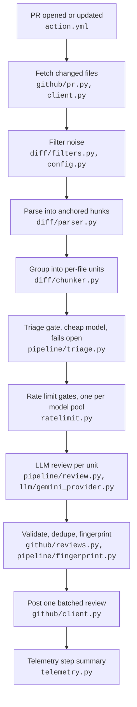

# ACROBOT

AI Code Review Org Bot: a GitHub Action that reviews pull request diffs with
an LLM and posts inline comments.

When a PR opens, the bot fetches the changed hunks through the GitHub API,
drops machine-written files, reviews each remaining file with a reasoning
model, checks every finding against the diff, and posts one batched review. It
never checks out or executes the code it reviews.

It runs on the Gemini free tier, so the scarce resource is request quota
rather than money. That constraint shaped the design: a cheap-model triage
gate, client-side rate limiting that degrades instead of failing, and recorded
provider responses so evals replay offline. On its first live runs it caught
both planted bugs (an off-by-one and a division by zero) with counterexamples,
found two unplanned edge cases, and produced two false positives that became
the first eval cases.

## How a review happens



Three rules shape the code:

1. **LLM output is untrusted input.** The model sits behind one provider
   interface, returns schema-validated JSON rather than prose to be parsed,
   and every finding's line anchor is checked against the parsed diff first.
   GitHub rejects a review whole if one anchor is bad, so a hallucinated line
   number costs one finding instead of the run.
2. **Request budget is the scarce resource.** Files are filtered before any
   model call, and a two-clock limiter (RPM window plus RPD daily budget)
   meters the rest. If the daily budget runs out mid-run, the bot posts a
   partial review with a warning instead of failing CI.
3. **Every run measures itself.** Per-stage tokens, latency, and the cost the
   run would have incurred on the paid tier go to the Actions step summary.

## Layout

| Path | What it does |
|---|---|
| `action.yml`, `__main__.py` | Composite Action that consumers `uses:`, and the orchestrator behind it |
| `config.py`, `schemas.py` | Config loaded from the target repo, and the enforced LLM output contract |
| `diff/` | Patch strings to hunks with a line map, noise filters, per-file grouping under a token budget |
| `llm/` | Vendor-agnostic `Provider` protocol, the Gemini adapter, and the versioned prompts. `ProviderAuthError` is deliberately not a `ProviderError` subclass, so no generic handler can swallow a dead key |
| `pipeline/` | Triage gate, review loop, content fingerprints for idempotent re-runs, and postprocess thresholds |
| `github/` | httpx client with pagination and backoff, anchor validation, one batched review call |
| `ratelimit.py`, `telemetry.py` | Two-clock limiter with an injectable clock, and per-stage usage reporting |
| `evalkit/`, `evals/` | Harness machinery, labeled cases over real-PR fixtures, and the false-positive ledger |
| `tests/` | 70 tests, including fake clocks, a fake provider, fail-open behavior, and budget exhaustion |

Design rationale, the fork-PR security policy, and the v2 roadmap are in
[docs/architecture.md](docs/architecture.md).

## Usage

```yaml
# .github/workflows/review.yml in your repo
name: AI Review
on:
  pull_request:
    types: [opened, synchronize, reopened, ready_for_review]
concurrency:
  group: acrobot-${{ github.event.pull_request.number }}
  cancel-in-progress: true
permissions:
  contents: read
  pull-requests: write
jobs:
  review:
    # Same-repo PRs only: fork PRs can't read secrets, and
    # pull_request_target + untrusted checkout is an RCE footgun.
    if: github.event.pull_request.head.repo.full_name == github.repository
    runs-on: ubuntu-latest
    steps:
      - uses: actions/checkout@v4   # so the action can read .github/acrobot.yml
      - uses: FazleRas/acrobot@v1   # floating major, moves with patch releases
        with:
          gemini_api_key: ${{ secrets.GEMINI_API_KEY }}
```

Pin `@v1` to track patch releases, `@v1.0.0` for an exact version, or the full
commit SHA (`FazleRas/acrobot@9d6b46a5b4e74d3c5fa4c3e3e088014be297398f`) if
your team pins actions by digest. CI checks that every ref this README
advertises still resolves.

Tuning is optional. Every key in `.github/acrobot.yml` has a default:

```yaml
models:
  triage: gemini-3.1-flash-lite   # or gemini-flash-lite-latest to float
  review: gemini-2.5-flash
rate_limits:      # per-model pools; defaults sit just under the observed
  review:         # free-tier caps. Daily pools are shared across all runs
    rpm: 4        # on one API key.
    rpd: 18
  triage:
    rpm: 12
    rpd: 800
triage_threshold: 4
confidence_threshold: 0.6
max_comments: 10
severity_floor: warning
# Globs are gitignore-style. `ignore` replaces the built-in defaults
# (**/*.lock, **/generated/**, **/*.min.*); `extend_ignore` appends to them,
# following ruff's exclude and extend-exclude. Most configs want extend_ignore.
extend_ignore:
  - "docs/**"
  - "/scripts"        # leading slash anchors to the repo root
```

> **Free-tier caveat:** Google's free tier may use prompts for model
> improvement. Run this on public repos only unless you are on a paid tier.

## Status

- [x] Diff parsing, filters, provider protocol and Gemini adapter, rate limiter, fingerprints
- [x] Review pass: structured findings, anchor validation, batched posting, partial-review degradation
- [x] Dogfooding on this repo and [AlphaLab](https://github.com/FazleRas/AlphaLab)
- [x] Chunker and postprocess: token budgeting, confidence, severity, and cap enforcement
- [x] Quota-honest rate limiting: real free-tier caps, server-advised 429 retries, partial review at the daily limit
- [x] Triage tier: cheap-model gate on a separate quota pool, fails open
- [x] Eval harness: labeled cases from real PRs, cassette replay in CI, recall and precision reports
- [ ] Provider benchmark: Anthropic adapter behind the same interface, compared on the eval set
- [ ] v2: repository context layer, AST-aware retrieval feeding the review pass

## Development

```sh
uv sync
uv run pytest
uv run ruff check . && uv run mypy
```

## Evals

```sh
uv run evals/runner.py           # cassette replay: deterministic, free, runs in CI
uv run evals/runner.py --live    # real API calls; records and refreshes cassettes
```

Cases are labeled diffs from real PRs, with expected findings matched by line
tolerance and keyword, plus clean diffs where any finding counts as a false
positive. Cassettes record provider responses at the protocol boundary, so CI
replays the whole pipeline for free and fails when a prompt change invalidates
a recording, which forces a live re-record before merge.

The seed set currently scores 75% recall and 100% precision. Across recordings
the same diff has scored 4/4, 2/4, and 3/4, so run-to-run variance is measured
rather than hidden.

The bot reviews every PR in this repo through `self-review.yml`. Its false
positives become eval cases, logged in [evals/notes.md](evals/notes.md), and
its fair points become issues.
